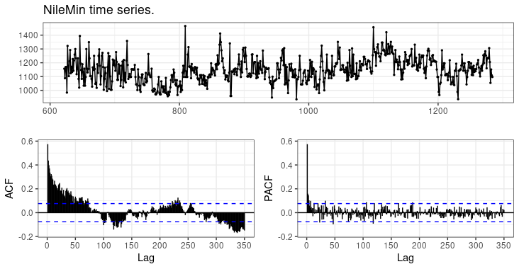
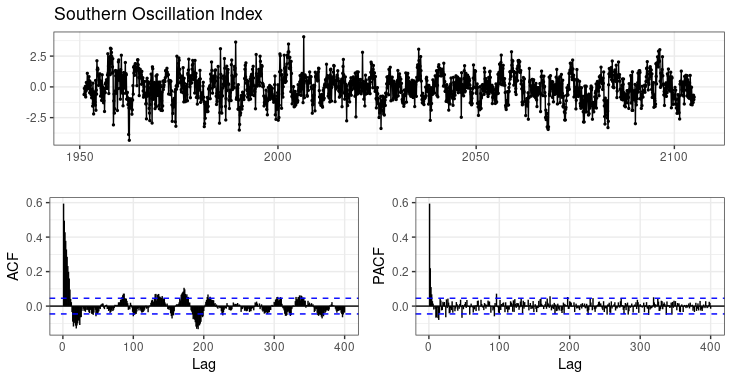
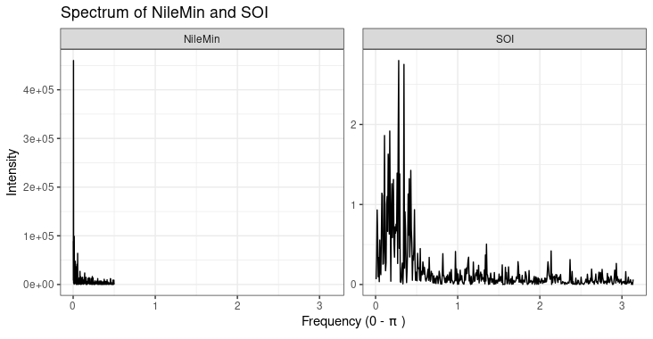
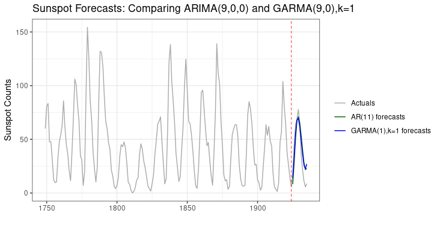

```{r, include = FALSE}
knitr::opts_chunk$set(
  collapse = TRUE,
  comment = "#>"
)
```

## Introduction to long memory models and GARMA models.

GARMA models are a type of time series models with special properties. These models are related to the "arima" models which can be fit in R by the standard "arima" function or the "Arima" function in the **forecast** package.

If you are not very familiar with ARIMA models, it might be advisable to first have a look at the excellent online book by Rob Hyndman and George Athanasopoulos:- [Forecasting: Principals and Practice](https://otexts.com/fpp2/).


---


GARMA models are a type of **long memory** model, also known as **fractal** models or **fractionally differenced** models. The reason for this is that they can model proceses which have a high correlation between observations which are far apart in time.

For instance, consider the data on the minimum level of the Nile [@Tousson1925], as measured from 622 to 1281 AD (from the **longmemo** package):
```
> library(tidyverse)
> library(forecast)
> data(NileMin,package='longmemo')
> # we'll just set the correct start year, for display purposes.
> NileMin<-ts(as.numeric(NileMin),start=622,frequency=1)
> 
> ggtsdisplay(NileMin,lag.max=350, main='NileMin time series.', theme=theme_bw())
```



The first thing to note here is that the ACF (the autocorrelation function) is showing highly significant correlations between Nile measurements, even at 350 years apart! 

We won't attempt to address the question of how it is that a flood or minima level of a river flow today could be significantly related to what was happening 350 years ago, but scientists believe this is a real affect, not an artifact of measurement. This time series has been investigated many times by researchers.

The phenomena of long memory has been identified in a number of different types of time series from sunspots [@Gray1989], the timing of xrays from Cygnus X1 [@Greenhough2002], inflation rates, exchange rates [@Caporale2014] and even in non-coding DNA [@Lopes2006].

---

Generically, long memory models (sometimes known as 'fractionally differenced' models) can also have 'short memory' components, and a number of these have been explored. One popular type of short memory model is the ARMA model. There are a number of R packages which can fit these models, including **fracdiff**, **longmemo**, **rugarch** and even **forecast**, among others.

These models are considered useful because they produce long range forecasts which tend to be more accurate than other short-memory models, particularly if the model assumptions are correct.


At time of writing there are few R packages on CRAN which can fit GARMA models.

Package **tswge** provides a function "est.garma.wge" which can fit a GARMA model, but unfortunately can only do so via a grid search technique (searching a grid of values of the likelihood function), which tends to be slow and can result in rather inaccurate results. It also does not allow any MA terms to be fitted.

Package **waveslim** has functions "spp.mle" and "spp2.mle" which can identify the parameters of a white noise process only (ie a process without any short memory component), using a wavelet method.

Package **VGAM** to have a function called "garma" but this actually fits very different models - it fits short-memory models which can include count data. Package **gsarima** also fits these short memory count models.

---

The models fit by the **garma** package are models which are not just long memory models, but where the long memory phenomena *cycles* in strength. An example of this is the Southern Oscillation Index.
```
> soi <-
+   read_fwf('soi.long.data',fwf_widths(c(5, rep(7,12)), c("year", 1:12)),col_types='nnnnnnnnnnnnn') %>%
+   gather(mth_no,soi,-year) %>%
+   mutate(mth = lubridate::make_date(year,as.numeric(mth_no),1)) %>%
+   select(mth,soi) %>%
+   arrange(mth)
> 
> soi_ts <- ts(soi$soi,start=c(1951,2),frequency=12)
> 
> ggtsdisplay(soi_ts, lag.max=400, main='Southern Oscillation Index', theme=theme_bw())
```


The first hing to note is that there are significant correlations in the ACF even up to lag 400, so this qualifies as a long memory process.

But also the ACF shows the cyclical nature which is very typical of Gegenbauer models.


---
When a long memory Gegenbauer model is combined with a short memory ARMA model, the result is known as a GARMA model.

GARMA stands for Gegenbauer AR-MA, and the AR and MA letters have their usual meaning in time series of "auto-regressive" and "moving average". 'Gegenbauer' refers to a mathematician Leopold Gegenbauer who lived in the 19th century and developed a series of orthogonal polynomials now called Gegenbauer polynomials, and sometimes called 'ultraspherical' polynomials [@Szego1959]. These polynomials feature strongly in the mathematics of GARMA models [@Gray1989], [@Gray1994].


All long memory models, including GARMA models, share one thing in common. When you examine them on the frequency domain, they will show evidence of an unbounded (read: very large) peak in the spectrum. The more traditional models - known as "short memory" models do not have such a peak - whilst the spectrum may vary up and down, a short memory model has a spectrum which has absolute bounds beyond which it will not go.

In the chart below we illustrate two long memory processes, one which would be well modelled by an ARFIMA model and the other which would be modelled by a Gegenbauer model.

```
> spectrum_nilemin <- spectrum(NileMin, plot=FALSE)
> spectrum_soi     <- spectrum(soi_ts,  plot=FALSE)
> # now munge these lists together into a single dataframe.
> spec_df <- rbind(data.frame(freq=spectrum_nilemin$freq,
+                             spec=spectrum_nilemin$spec, 
+                             process='NileMin'),
+                  data.frame(freq=spectrum_soi$freq,     
+                             spec=spectrum_soi$spec,     
+                             process='SOI'))
> # and plot
> ggplot(filter(spec_df,freq<pi), aes(x=freq,y=spec)) +
+   geom_line() + 
+   facet_wrap(.~process,scales='free_y') +
+   ggtitle('Spectrum of NileMin and SOI') + 
+   ylab('Intensity') + 
+   xlab(bquote('Frequency (0 -' ~ pi ~')' )) + xlim(0,pi) +
+   theme_bw()
```



From the above you can see that the NileMin spectrum shows an (essentially) unbounded peak at 0 which is the marker of a traditional long memory process.

However the SOI has 3 main peaks, all separated away from 0. Although these are not as large as the NileMin peaks, compared with the rest of the spectrum they are quite large, so it is not inappropriate to at least try to model the SOI by a 3-factor (or $k=3$) Gegenbauer model. This was first pointed out by [@Lustig2017].

## Technical details of the model.

The GARMA model as fit by the **garma** package is specified as
$$ \displaystyle{\phi(B)\prod_{i=1}^{k}(1-2u_{i}B+B^{2})^{d_{i}}(1-B)^{id}(X_{t}-\mu)= \theta(B) \epsilon _{t}} $$
where

1. $\phi(B)$ represents the short-memory Autoregressive component of order p,
2. $\theta(B)$ represents the short-memory Moving Average component of order q,
3. $(1-2u_{i}B+B^{2})^{d_{i}}$ represents the long-memory Gegenbauer component (there may in general be k of these),
4. $id$ represents integer differencing (currently only $id$=0 or 1 is supported).
5. $X_{t}$ represents the observed process,
6. $\epsilon_{t}$ represents the random component of the model - these are assumed to be uncorrelated but identically distributed variates.
     Generally the routines in this package will work best if these have an approximate Gaussian distribution.
7. $B$ represents the Backshift operator, defined by $B X_{t}=X_{t-1}$.

When $k=0$, then this is just a short memory model as fit by the stats "arima" function.


## Fitting a short memory model

We have deliberately kept the fitting process close to that of the "arima" and "forecast::Arima" functions.

To illustrate basic usage of the routine, we will first look at fitting a simple ARIMA model to the "AirPassengers" data supplied with R. To achieve stationarity with this data, we'll need to seasonally difference it. The "arima" function can do this but unfortunately "garma" as yet does not fit a seasonal model - seasonality is essentially modelled by the Gegenbauer components, but we won't initially use that.

To ensure the results are as comparable as possible we will work with the seasonally differenced series, and specify the estimation method as 'CSS' for both.

```
> # GARMA model
> # Note in the below we specify k=0.
> # This tells the routine is not to fit a Gegenbauer/GARMA model.
> garma_mdl <- garma(ap,order=c(9,1,0),k=0,method='CSS')
> summary(garma_mdl)

Call:
garma(x = ap, order = c(9, 1, 0), k = 0, method = "CSS")

No Mean term was fitted.
Drift (trend) term was fitted.

Convergence Code: 0
Optimal Value found: 16150.37572243

Coefficients:
           ar1       ar2       ar3       ar4       ar5      ar6      ar7       ar8     ar9    drift
      -0.32003  -0.01625  -0.13821  -0.23457  -0.01306  0.03086  -0.1504  -0.09221  0.2211  0.19353
s.e.   0.07194   0.08475   0.08014   0.06856   0.06669  0.07748   0.0744   0.07860  0.0794  0.03675


sigma^2 estimated as 123.2853: part log likelihood = -501.230781

AR Factor Table.

Coefficients of Original polynomial:  
-0.3200 -0.0163 -0.1382 -0.2346 -0.0131 0.0309 -0.1504 -0.0922 0.2211 

Factor                 Roots                Abs Recip    System Freq 
1+1.0357B+0.8090B^2   -0.6401+-0.9090i      0.8995       0.3476
1+1.6600B+0.7690B^2   -1.0793+-0.3681i      0.8769       0.4477
1-0.4062B+0.7464B^2    0.2721+-1.1250i      0.8639       0.2122
1-1.2885B+0.6991B^2    0.9215+-0.7623i      0.8361       0.1100
1-0.6809B              1.4686               0.6809       0.0000
```
We note here that [@Box2015] advise taking logarithms as the more correct way to model this data, however we are illustrating the similarity of methods here and feel additional code may obscure the intention. The interested reader may care to repeat this using logs themselves.

As can be seen above, the coefficients produced are similar but not identical - the log-likelihood from the "garma" run is a larger value than that produced by the "arima" run, indicating that the routine has in fact found a (slightly) better solution (estimating parameters like these involves non-linear optimisation - "arima" uses R's built-in optimiser called "optim"; garma however by default uses "solnp" from the **Rsolnp** package).

## Fitting a GARMA model.

In this section we'll look at fitting a GARMA model to the Sunspots data, which is supplied with R. This data has been analysed many times in the literature; the first time with a GARMA model was by [@Gray1989]. Generally, authors have used a standard subset of this data from 1749 to 1924.

The Sunspot data consists of counts of sunspots as observed over a considerable period. In terms of ARIMA models, [@Box2015] suggest an AR(9) model may be best.

First we fit an ARIMA model to this data:
```
> data(sunspot.year)
> 
> # Next we subset the data to ensure we are using the years used in the literature.
> sunspots <- ts(sunspot.year[49:224],start=1749,end=1924)
> 
> # Now as in Gray et al 1989 we fit a GARMA(1,0) model:
> sunspots_arima_mdl <- arima(sunspots, order=c(9,0,0),method='CSS')
> 
> summary(sunspots_arima_mdl)

Call:
arima(x = sunspots, order = c(9, 0, 0), method = "CSS")

Coefficients:
         ar1      ar2      ar3     ar4      ar5     ar6      ar7     ar8     ar9  intercept
      1.2419  -0.4976  -0.1406  0.1943  -0.1767  0.0979  -0.1139  0.1435  0.0570    45.1427
s.e.  0.0753   0.1195   0.1245  0.1247   0.1245  0.1234   0.1266  0.1228  0.0766     5.6748

sigma^2 estimated as 213.5:  part log likelihood = -721.72

Training set error measures:
                        ME     RMSE      MAE  MPE MAPE      MASE         ACF1
Training set -0.0002709438 14.23214 10.49252 -Inf  Inf 0.6405913 -0.001348032
```

Next we look at a GARMA model, but instead of 9 AR parameters, we will only fit 1.
```
> library(garma)
> 
> data(sunspot.year)
> 
> # Next we subset the data to ensure we are using the years used in the literature.
> sunspots <- ts(sunspot.year[49:224],start=1749,end=1924)
> 
> # Now as in Gray et al 1989 we fit a GARMA(1,0) model:
> sunspots_garma_mdl <- garma(sunspots, order=c(1,0,0),k=1,method='CSS')
> 
> summary(sunspots_garma_mdl)

Call:
garma(x = sunspots, order = c(1, 0, 0), k = 1, method = "CSS")

Mean term was fitted.
No Drift (trend) term was fitted.

Convergence Code: 0
Optimal Value found: 40145.33980554

Coefficients:
      intercept        u1     fd1     ar1
       45.13719  0.847533  0.4228  0.4937
s.e.    0.02675  0.007103  0.1260  0.1119

                        Factor1
Gegenbauer frequency:    0.0890
Gegenbauer Period:      11.2305
Gegenbauer Exponent:     0.4228


sigma^2 estimated as 228.0985: part log likelihood = -727.553615

AR Factor Table.

Coefficients of Original polynomial:  
0.4937 

Factor                 Roots                Abs Recip    System Freq 
1-0.4937B              2.0257               0.4937       0.0000
```
For the GARMA model, we have specified **method='CSS'** to ensure we are using a method as close as possible to that used by [@Gray1989]. The "garma" function uses a frequency-domain method known as the "Whittle" method by default, since this method not only produces very accurate results very quickly, but also has a lot of theoretical results available to support its use - for example [@Giraitis2001].

The following table compares the values found by Gray et al and by the "garma" function:

Parameter  | Gray et al |  garma |
-----------|-----------:|-------:|
intercept  | 44.78      | 45.1350 |
u          | 0.85       | 0.8475 |
d          | 0.42       | 0.4228 |
ar1        | 0.49       | 0.4937 |

As you can see, the results are quite close (Gray et al only published their results to 2 decimal places).

Notice also that the routine displays the Gegenbauer Period - in this case 11.2 years - which corresponds nicely with the "known" 11 year sunspot cycle.

Also shown is the degree of fractional differencing and the Fractional Dimension of the original series.

Whilst this model does fit the data quite well, is quite simple and does not produce very effective forecasts. A better model is the GARMA(8,0) model, which was also examined by [@Gray1989], however to compare with the ARIMA model, we can fit the same number of AR terms - 9 - and then forecast below, for the next sunspot cycle.
```
> library(yardstick)
> (sunspots_garma_mdl <- garma(sunspots, order = c(9, 0, 0), k = 1))

Call:
garma(x = sunspots, order = c(9, 0, 0), k = 1)

Mean term was fitted.
No Drift (trend) term was fitted.

Coefficients:
      intercept      u1     fd1     ar1      ar2       ar3      ar4      ar5      ar6      ar7      ar8      ar9
          45.03  0.8413  0.1213  0.9994  -0.2925  -0.16877  0.18380  -0.1445  0.03879  0.01112  0.04964  0.09302
s.e.     136.53  0.0539  0.2833  0.4598   0.3662   0.07609  0.09225   0.1093  0.08272  0.07614  0.07520  0.07293

                        Factor1
Gegenbauer frequency:    0.0909
Gegenbauer Period:      11.0000
Gegenbauer Exponent:     0.1213


sigma^2 estimated as 34.3504: approx. log likelihood = -342.309594, aic = 710.619187

AR Factor Table.

Coefficients of Original polynomial:  
0.9994 -0.2925 -0.1688 0.1838 -0.1445 0.0388 0.0111 0.0496 0.0930 

Factor                 Roots                Abs Recip    System Freq 
1-1.4790B+0.8427B^2    0.8776+-0.6454i      0.9180       0.1009
1-0.9014B              1.1094               0.9014       0.0000
1-0.4277B+0.6241B^2    0.3427+-1.2186i      0.7900       0.2064
1+0.5167B+0.4431B^2   -0.5830+-1.3844i      0.6657       0.3134
1+1.2920B+0.4428B^2   -1.4588+-0.3606i      0.6655       0.4614
  
  
> 
> compare_df <- data.frame(yr=1925:1935,
+                          Actuals=as.numeric(sunspot.year[225:235]),
+                          ARIMA=forecast(sunspots_arima_mdl,h=11)$mean,
+                          GARMA=forecast(sunspots_garma_mdl,h=11)$mean)
> 
> cat(sprintf('\n\nEvaluating Test set data from 1925 to 1936.\n\nARIMA RMSE: %.2f\nGARMA RMSE: %.2f\n',
+             yardstick::rmse(compare_df,Actuals,ARIMA)$.estimate,
+             yardstick::rmse(compare_df,Actuals,GARMA)$.estimate))


Evaluating Test set data from 1925 to 1936.

ARIMA RMSE: 13.59
GARMA RMSE: 11.73
```
The RMSE for the ARIMA model is 13.59 and the RMSE for the GARMA model is 11.73 - which shows in terms of future predictions the GARMA model has a smaller error.

But visually there appears to be little difference between the models.

```
> arima_df <- data.frame(yr=1925:1935, sunspots=forecast(sunspots_arima_mdl,h=11)$mean,grp='AR(11) forecasts')
> 
> garma_df <- data.frame(yr=1925:1935, sunspots=forecast(sunspots_garma_mdl,h=11)$mean,grp='GARMA(1),k=1 forecasts')
> 
> actuals_df <- data.frame(yr=1749:1935,sunspots=as.numeric(sunspot.year[49:235]),grp='Actuals')
> 
> df <- rbind(actuals_df,garma_df,arima_df)
> 
> ggplot(df,aes(x=yr,y=sunspots,color=grp)) + geom_line() +
+     scale_color_manual(name='',values=c('Actuals'='darkgray','AR(11) forecasts'='darkgreen','GARMA(1),k=1 forecasts'='blue')) +
+     xlab('') + ylab('Sunspot Counts') +
+     geom_vline(xintercept=1924,color='red',linetype='dashed',size=0.3) +
+     theme_bw() +
+     ggtitle('Sunspot Forecasts: Comparing ARIMA(9,0,0) and GARMA(9,0),k=1')
```


## References
